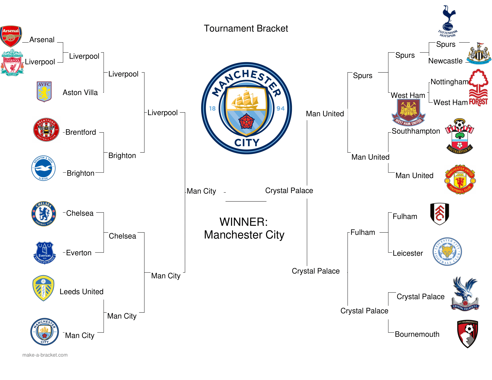

# Premier League Analysis

Welcome to the Premier League Analysis repository! This collaborative project, led by Mohammad Rasool and Parimal Kashireddy, explores the intricate world of Premier League player and club performance through data analytics and machine learning. Here's a guide to navigating our repository.

# Hadoop MapReduce Jobs

The Hadoop MapReduce Jobs folder contains all of the Hadoop processes used to sift and clean the data. The dataset was originally 20GB so alot had to be cleaned.

# Intermediate Datasets

The Intermediate Datasets folder contains the ACTUAL data that we were able to use after filtering most of the useless attributes. Now we could finally make the ML algorithms to make predictions.  

# We created two separate algorithms: Predict by Team Players & Predict by Team History.

## Algorithm 1: Predict by Team Players

This algorithm comprises two main parts:

## Part 1: Top 11 Players by Club
The first segment reads data from a CSV file, filters it to identify the top 11 players based on their attributes, and then groups these players by their respective club names. The algorithm subsequently prints the names of these top players for each club that boasts at least 11 top players. This functionality mirrors the purpose of the "Get Top 11 Players from each Premier League Team" MapReduce job mentioned earlier.

## Part 2: Linear Regression Model
The second part involves a Linear Regression model that predicts the winners and scores of potential games between football clubs using logistic regression. Here's a breakdown of the steps:

- **Data Loading:** It loads data from a CSV file.
- **User Input Filtering:** The data is filtered based on user input.
- **Club Grouping:** The data is grouped by club.
- **Normalization:** A new DataFrame is created, with each row representing a potential game between two clubs in the filtered list. The data is normalized.
- **Model Training:** A logistic regression model is trained on this normalized data.
- **Prediction:** The algorithm predicts the winners and scores of potential games using the trained model.
- **Fallback Mechanism:** In case of faulty data, the algorithm selects the team with a higher rating as the winner and predicts the score accordingly.

### Demo
You can watch a demonstration of this algorithm in action in [this video](https://youtu.be/waoNPUdPk1w).

## Algorithm 2: Predict by Team History

This algorithm utilizes historical data obtained from the Premier League Website to predict future games using the Poisson distribution algorithm. Here's a breakdown of the steps:

- **Data Loading:** The algorithm reads in historical data from a CSV file and creates a DataFrame called `df_history_data`.
- **DataFrame Creation:** Two new DataFrames, `df_home` and `df_away`, are created from `df_history_data`, and their columns are renamed.
- **Team Strength Aggregation:** A new DataFrame, `df_team_strength`, is created by aggregating the `df_home` and `df_away` DataFrames for each team.
- **Poisson Distribution Prediction:** A function named `predict_points` is defined to calculate the expected number of points for two teams using the Poisson distribution. The function takes two arguments, `home` and `away`, and returns the predicted points for each team.
- **User Interaction:** The user is prompted to enter two team names, and the `predict_points` function is called with these names.
- **Outcome Printing:** The predicted winner or draw is printed to the console.

### Demo
You can watch a demonstration of this algorithm in action in [this video](https://youtu.be/YgqQAc-qz9Y).

# Tournament Bracket

Using the algorithm **Predict by Team History**, we generated a randomized tournament bracket:

